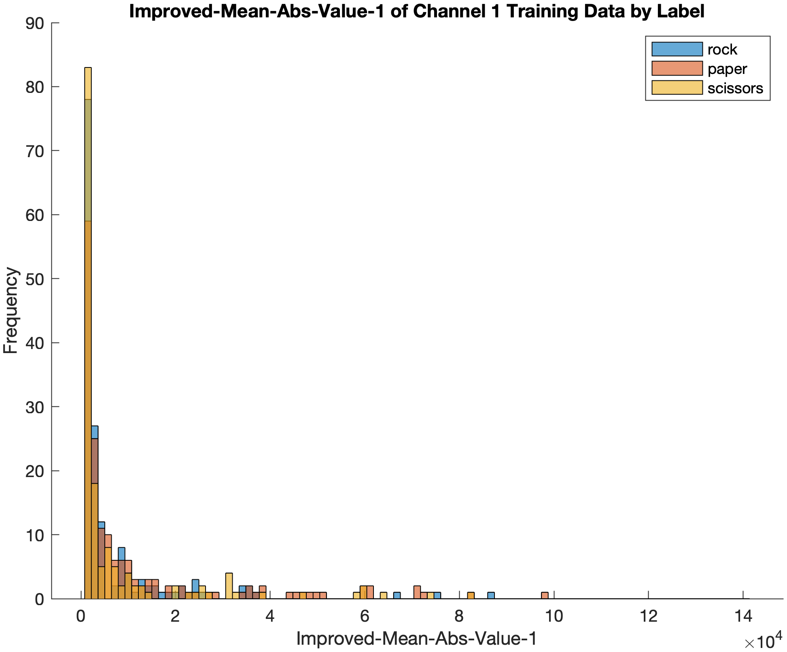
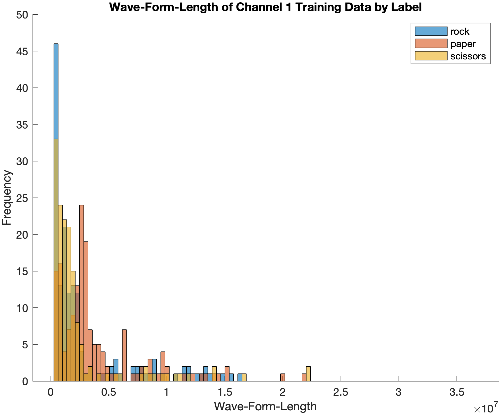
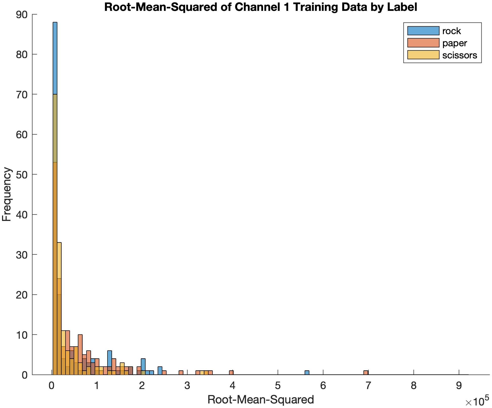
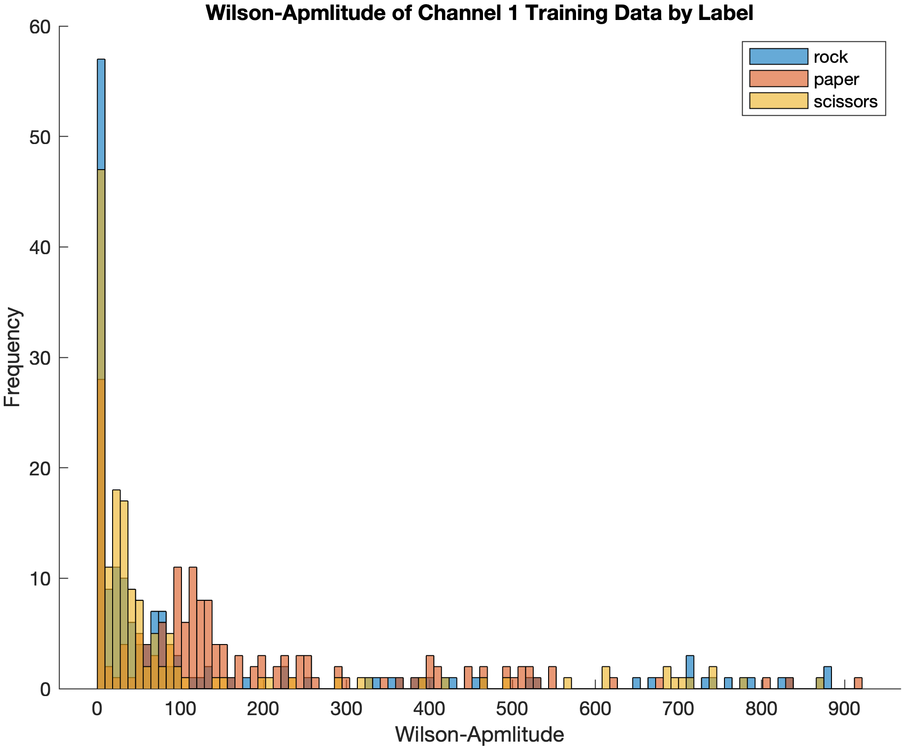

# neurotech

# Extracted Feature Histograms of Training Data by Label

### Mean Absolute Value

    

### Improved Mean Absolute Value

    

### Wave Form Length

    

### Root Mean Squared

    

### Mean Power

    

### Wilson Amplitude

    

